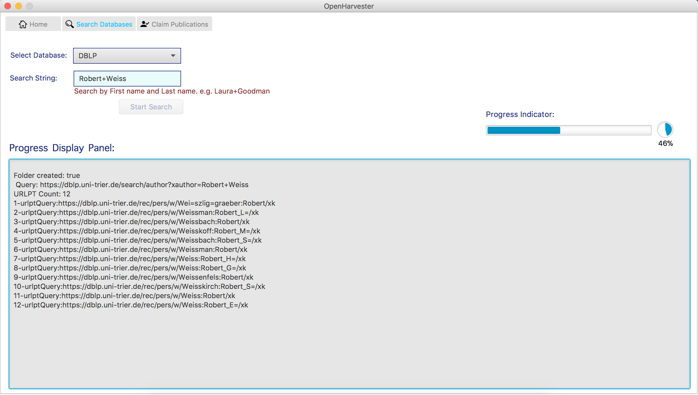
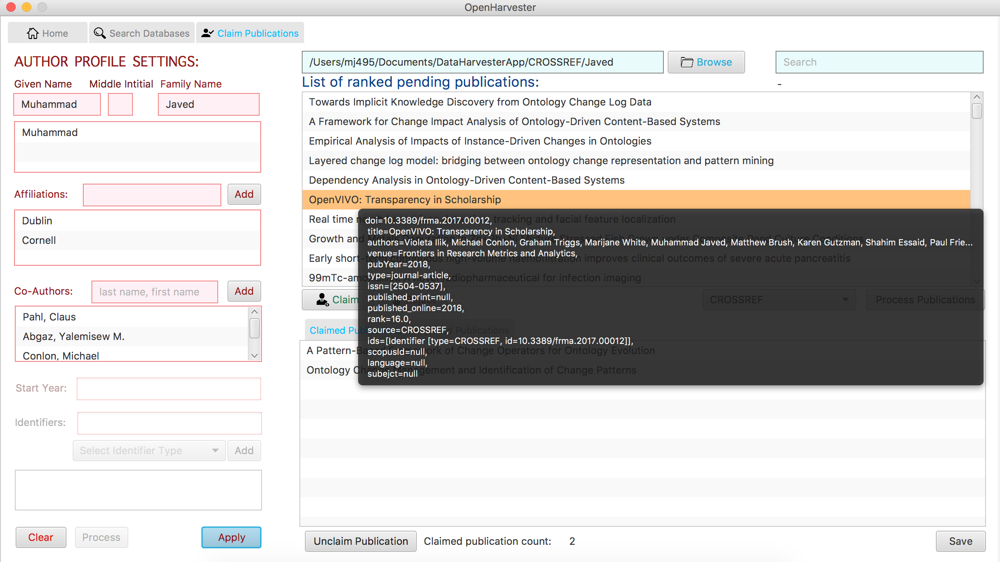
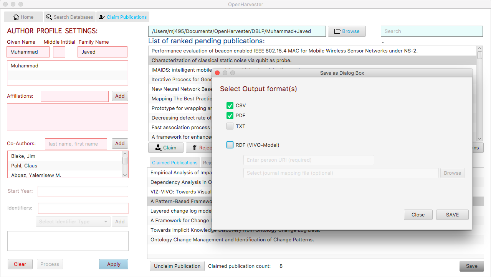

# OpenHarvester


OpenHarvester harvest publications metadata from different sources (CrossRef, PubMed and DBLP) and identify publications for an author.

``` 
Latest Version of the Jar file -   PH-12042018.jar
```

# How to Run

Download the github repo in a preferred location and unzip it. The project contains the runnable jar file.

Use following command to run the jar file.
```
java -jar <<latest jar filename>> <<path to the github repo folder>>
```

For example, 
```
java -jar PH-12042018.jar /Users/mj125/Documents/OpenHarvester/
```

The program works in two separate steps.

**Step 1 (Search Databases):** Search Publications in a database of interest. Use tips given (under the text field area) for specifying ''search string''



*** Depending on how common an author's last name is, in most cases the search step may take from 1 minute to 20 minutes (or more). In future, once persistent layer is added, minimal required information can be stored from a data dump and hence live queries may not be required.


**Step 2 (Claim Publications):**  Claim publications from the downloaded data. For this, a user should record some important information in the author profile, including first name, middle initial, last name and preferably affiliation string. For example, if one is affiliated to Duke University, one may want to add "Duke" in the affiliation list. Adding a co-author in the author profile also help in identifying correct publications.



**Step 3 (Save):** Save the claimed publications in different format. Currently, CSV, PDF and RDF (VIVO Model) are supported. This is also work under progress.




**Contact:** 
Muhammad Javed (mj495@cornell.edu)
